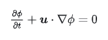
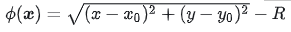
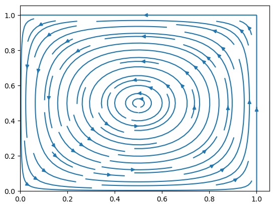
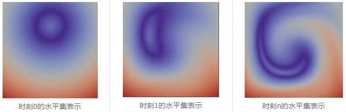

<center>水平集在速度场下随时间的变化过程</center>

水平集的控制方程如下:<br>

<center>

<br>
图一、水平集的控制方程
</center>
可以发现水平集的控制方程只有一个对流项

假设一个水平集的函数
<center>

<br>
图2、水平集的初始条件
</center>
流场函数如下

```python
ux = (np.sin(np.pi*mesh_x)**2)*np.sin(2*np.pi*mesh_y)
uy = -(np.sin(np.pi*mesh_y)**2)*np.sin(2*np.pi*mesh_x)
```
流场如下图所示:
<center>

<br>
</center>

最后的求解结果

<br>

